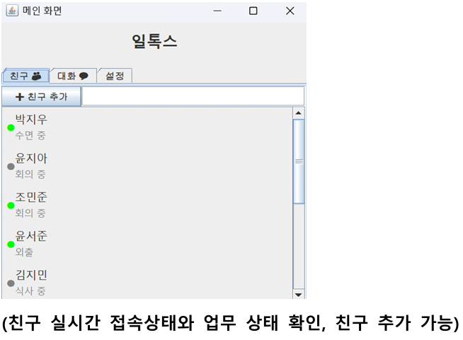
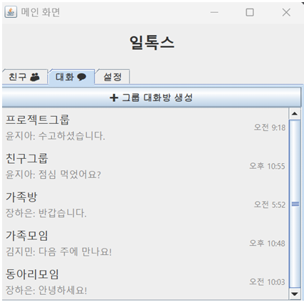
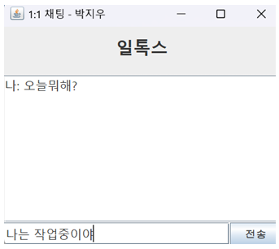
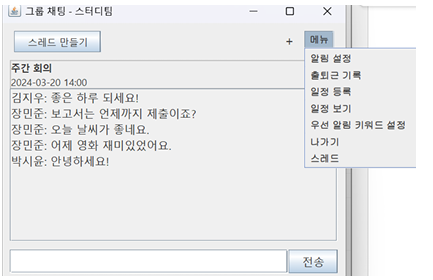
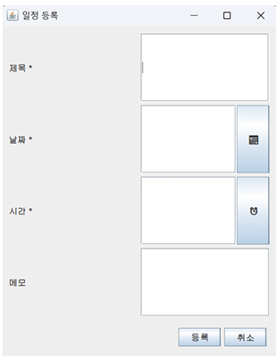
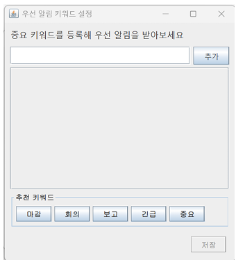
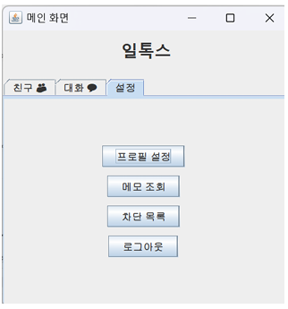
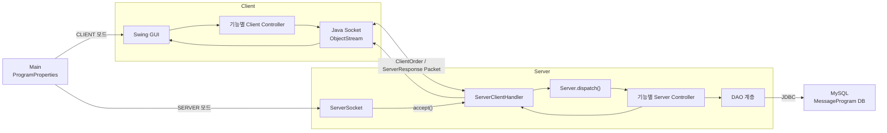
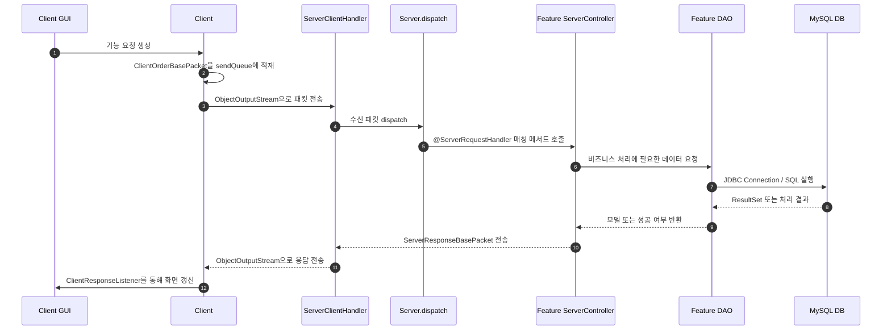
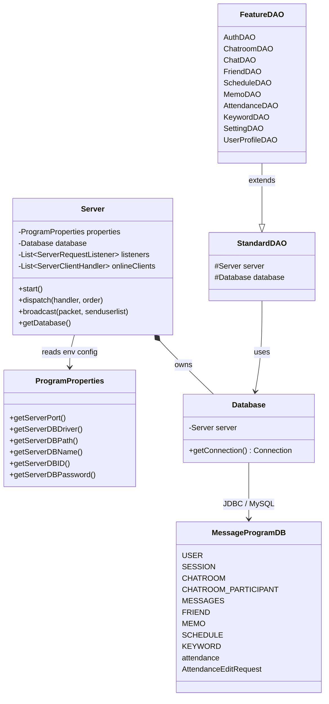

# 드리는 말씀

이 README.md가 있는 브랜치는 __**프로젝트 확장, 협업과 기능 구현을 용이하게 하기 위해 새로 작성되었습니다.**__ 
다른 브랜치와 호환되지 않을 수 있습니다.

 

# 프로젝트 소개

일톡스는 `work-talks`를 한글로 표현한 이름으로, 기업 및 조직 내 실시간 커뮤니케이션과 협업 강화를 위해 개발된 Java 기반 메신저 프로그램입니다.
기존 메신저의 기본 채팅 기능에서 나아가 업무 메신저 상황에 특화된 기능을 제공하여 실질적인 업무 지원 도구로 활용할 수 있도록 설계되었습니다.

## 차별화된 주요 기능

- **키워드 우선 알림 기능**: 대화방에서 사용자가 설정한 키워드가 포함된 메시지에 대해 즉시 알림을 받을 수 있습니다.
- **공식 일정 등록 기능**: 대화방 내 일정 등록 및 확인 기능을 통해 주요 일정을 관리할 수 있습니다.
- **스레드 기능**: 대화방 내에서 별도 하위 대화방을 생성하여 주제별 대화를 진행할 수 있습니다.
- **채팅-메모 북마크 기능**: 중요한 메시지를 메모로 저장하고, 메시지별 추가 메모 작성과 메모 내역 조회, 수정, 삭제를 할 수 있습니다.
- **업무 상태 설정 기능**: 회의 중, 집중 모드 등 현재 업무 상태를 설정하고 친구의 업무 상태를 확인할 수 있습니다.
- **출퇴근 기록 기능**: 그룹 대화방에서 사용자의 출근 및 퇴근 시간을 기록하고 조회할 수 있습니다.

## 시연영상

[프로젝트 시연영상](https://drive.google.com/file/d/1VngEmnBIHNo_RBN3bqUKMilCMmkL6HJ4/view?usp=sharing)

## 주요 화면

| 메인 화면 | 대화방 메인 화면 |
| --- | --- |
|  |  |

| 1대1 채팅 화면 | 그룹 대화방 화면 |
| --- | --- |
|  |  |

| 대화방 일정 등록 화면 | 키워드 설정 화면 |
| --- | --- |
|  |  |

| 설정 메인 화면 |
| --- |
|  |

## 핵심 기술

- **기능별 패키지 구조 설계**: `clientside`, `serverside`, `shared` 패키지 분리를 통해 인증, 친구, 채팅, 일정 등 도메인을 독립적으로 관리할 수 있도록 구성했습니다.
- **어노테이션 기반 패킷 라우팅**: 서버 요청 처리를 기능별 컨트롤러로 분산하고 어노테이션 기반 라우팅을 적용하여, 신규 기능 추가 시 기존 분기 로직 수정을 최소화했습니다.
- **DAO 공통 추상화**: 기능별 DAO를 `StandardDAO` 기반으로 구성하여 비즈니스 로직과 데이터 접근 책임을 분리했습니다.
- **기능 단위 모듈화**: 기능별 책임 범위를 명확히 나누어 장애 발생 시 영향 범위를 특정 기능 내부로 제한하고, 담당 팀원이 빠르게 원인을 파악하고 수정할 수 있는 협업 구조를 구축했습니다.
- **실시간 채팅 통신 구조**: Java Socket 기반 실시간 채팅 시스템을 설계 및 구현하고, 멀티스레드와 `BlockingQueue`를 활용해 동시 접속 환경에서도 안정적으로 메시지를 처리할 수 있도록 구성했습니다.
- **화면 갱신 문제 개선**: 채팅방 초대 후 화면이 갱신되지 않는 문제를 채팅방 모듈 범위로 좁혀 분석하고, 주기적 새로고침 로직을 적용해 해결했습니다.

## 전체 아키텍처

프로그램은 `Main`에서 환경 변수 `CLS032690125oop3team_MODE` 값을 읽어 `CLIENT` 또는 `SERVER` 모드로 실행됩니다. 클라이언트는 Swing GUI와 기능별 클라이언트 컨트롤러를 통해 요청 패킷을 만들고, Java Socket의 `ObjectOutputStream`으로 서버에 전송합니다. 서버는 클라이언트별 `ServerClientHandler` 스레드를 생성한 뒤, 수신한 패킷을 기능별 서버 컨트롤러에 라우팅하고 DAO 계층을 통해 MySQL 데이터베이스에 접근합니다.

### 서버 내부 요청 처리 흐름

서버 컨트롤러는 `ServerRequestListener`를 상속하고, 요청 처리 메서드에 `@ServerRequestHandler`를 붙여 담당 패킷 타입을 등록합니다. `Server.dispatch()`는 수신한 `ClientOrderBasePacket`의 실제 클래스와 매칭되는 핸들러를 호출하며, 각 컨트롤러는 필요한 경우 DAO를 통해 DB를 조회하거나 변경한 뒤 `ServerResponseBasePacket`을 클라이언트에 응답합니다.

### DB 접근 구조

DB 연결 정보는 서버 모드 실행 시 환경 변수에서 `ProgramProperties`로 로드됩니다. `Database`는 서버 시작 시 JDBC 드라이버를 로드하고, DAO가 요청할 때마다 `DriverManager.getConnection(DB_PATH/DB_NAME, DB_ID, DB_PASSWORD)` 형태로 MySQL 연결을 생성합니다.

## 담당 역할 및 기여

- **친구 관리 기능 구현**: 친구 검색 및 친구 추가 기능을 구현하고, 친구 삭제 및 차단 기능을 통해 사용자 간 관계를 관리할 수 있도록 구성했습니다.
- **채팅방 기능 구현**: 스레드 채팅방 구성을 담당하여 대화방 내 주제별 하위 대화를 지원하고, 채팅방에 친구를 초대하는 기능과 채팅방 대화 관리 기능을 구현했습니다.
- **채팅방 메모 기능 구현**: 채팅 메시지를 기반으로 메모를 작성, 조회, 수정, 삭제할 수 있는 채팅방 메모 기능을 구현했습니다.
- **GUI 화면 구성**: 전체 GUI 화면 구성을 담당하여 사용자가 친구, 채팅방, 스레드, 메모 등 주요 기능을 화면에서 사용할 수 있도록 연결했습니다.
- **프로젝트 구조 공동 설계**: 개발 경험이 있는 팀원과 함께 `clientside`, `serverside`, `dto`, `dao` 등 프로젝트 전체 구조를 설계하고, 기능별 책임이 분리되는 구조로 확장성과 협업 효율을 높였습니다.

 

# 실행을 위한 설정

## 라이브러리

### JDK 21
JDK 21을 사용합니다.

### MySQL
1. `mysql-connector-j`를 다운받습니다. 버전은 `8.x`, `9.x`가 알맞습니다.
2. IntelliJ에서 `파일 -> 프로젝트 구조 -> 라이브러리`에서 JAR 파일을 추가합니다.

## ENV 설정
### Client
1. `env/client.example.env`을 참조하십시오.
2. 위 예시 파일을 참고하여 `env/client.local.env`를 생성한 후 알맞게 수정하십시오.

### Server
1. `env/server.example.env`을 참조하십시오.
2. 위 예시 파일을 참고하여 `env/server.local.env`를 생성한 후 알맞게 수정하십시오.

 

# 패키지, 클래스 구조
패키지는 `kr.ac.catholic.cls032690125.oop3team`입니다. 
`cls032690125`는 강의 고유번호와 분반, 연도를 의미합니다.

## .client
클라이언트 관련 코드를 구현합니다.

## .exceptions
예외 클래스의 패키지입니다.

## .features
**__기능 구현과 기능 관련 GUI 코드는 전부 이곳에 들어갑니다.__** 
패키지 하부에는 각 기능별 패키지로 분리되어 있고, 각 패키지는 아래의 요소를 가집니다: 
 
`.<feature>`
- `.clientside` - 클라이언트 코드를 넣습니다.
  - `.clientside.gui` - GUI 코드를 넣습니다.
- `.serverside` - 서버 코드를 넣습니다.
- `.shared` - 패킷 클래스를 넣습니다.

## .models
모든 엔티티 클래스가 이곳에 들어갑니다. 
하부 패키지로 `.response`가 있으며 이는 친구 기능의 유저 정보 등 화면 표시를 위한 정보를 전달할 때 사용할 엔티티입니다.

## .server
서버 관련 코드를 구현합니다.

## .shared
패킷 관련 클래스를 넣습니다.

## .Main
프로그램 실행의 시작점이 되는 클래스입니다.
